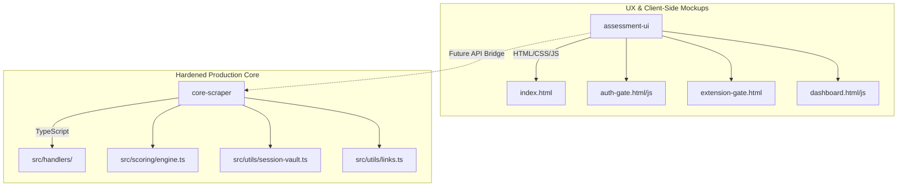

# Assessment UI: UX Mockup & Production Hardening Guide

This folder (`apps/assessment-ui`) houses the client-side user experience mockup for the **Revenue Journey Diagnostic Gate & Assessment Dashboard**. It is designed to model and refine the authentication and reporting workflows before they are connected to the production scraping engine.

---

## 1. Hierarchical Isolation & Structure

The codebase is strictly separated into frontend and backend components within a monorepo structure:



* **Frontend (`apps/assessment-ui/`)**: A pure client-side application. It runs inside a basic Express webserver (`server.js`) on port `3001` and is entirely decoupled from the TypeScript compilation. It does not import or execute backend code directly.
* **Backend Core (`packages/core-scraper/`)**: A hardened, production-ready Crawlee/Playwright scraper and grading engine. It runs on Apify or standalone Node environments, utilizing strong input filtering, proxy rotation, and database upserts.

---

## 2. Current Mock Parameters (State Management)

The demo UI simulates state using the browser's `sessionStorage`. Below are the keys and values configured during the gateway workflow:

* **`auth_completed`** (`"true"`): Set when the user completes either the Direct Authentication or Chrome Extension setup. Used to guard dashboard access; if missing, redirects to `index.html`.
* **`auth_source`** (`"web-auth"` | `"extension"`): Tracks which gateway path the user completed.
* **`connected_platforms`** (`Array<string>`): A JSON-serialized array of connected platform identifiers (e.g. `["linkedin", "facebook", "instagram", "twitter"]`). This dynamically drives the connection indicators on the dashboard sidebar.

---

## 3. Hardening Roadmap: Transitioning from Mockup to Production

To move this frontend into a production-hardened environment, implement the following bridges:

### Step 1: Direct Authentication Gateway
* **Mock Behavior**: Submitting the login form triggers a local loop in `auth-gate.js` printing simulated logs.
* **Hardening Change**: Change the form submit handler to make an HTTP POST request to a backend API router (e.g., `/api/auth/verify`). The backend should:
  1. Sprout an isolated, headless Playwright browser instance.
  2. Navigate to the login page of the platform using proxies and stealth settings.
  3. Attempt the login and capture session cookies.
  4. Save the cookies in the secure PostgreSQL/Supabase database via the `SessionVault` module.

### Step 2: Chrome Extension Integration
* **Mock Behavior**: Clicking "Download ZIP" downloads a placeholder file and triggers a client-side terminal sync simulation.
* **Hardening Change**: 
  1. Compile a manifest-v3 Chrome Extension that reads active cookie stores for selected domains (requires the `cookies` and `host permissions` APIs in the extension manifest).
  2. Modify the extension popup to post these cookies to your backend vault endpoint (`/api/vault/sync`).
  3. Change the web interface to open a secure WebSocket connection to `/api/vault/handshake` to await the incoming session payload and update the terminal logs in real-time.

### Step 3: Running the Scraper & Log Streaming
* **Mock Behavior**: The "Start Audit Run" button triggers a client-side timer that animates logs and progress.
* **Hardening Change**:
  1. Wire the button to make a POST request to `/api/audit/run`, passing the target business URLs and SERP keyword configurations.
  2. The server spins up the `core-scraper` crawler worker.
  3. Stream execution logs (loggers from `packages/core-scraper/src/utils/logger.ts`) back to the dashboard's log console via WebSockets or Server-Sent Events (SSE).
  4. Once complete, fetch the newly populated grades and insights from Supabase using the database utilities in `core-scraper`.

---

## 4. Local Execution for UX Workflows

To run the mockup server locally:

```bash
# Start the UI server on http://localhost:3001
npm start --workspace=assessment-ui
```
